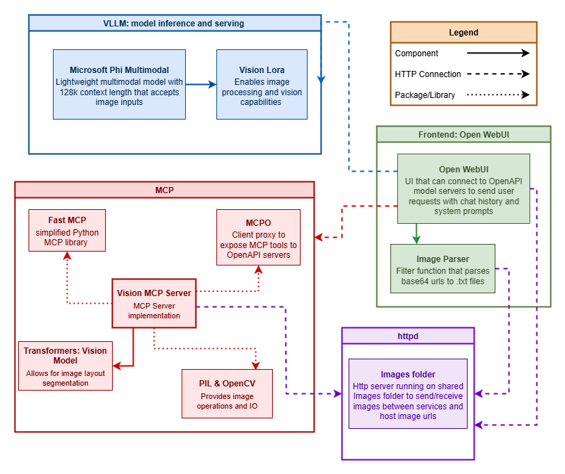
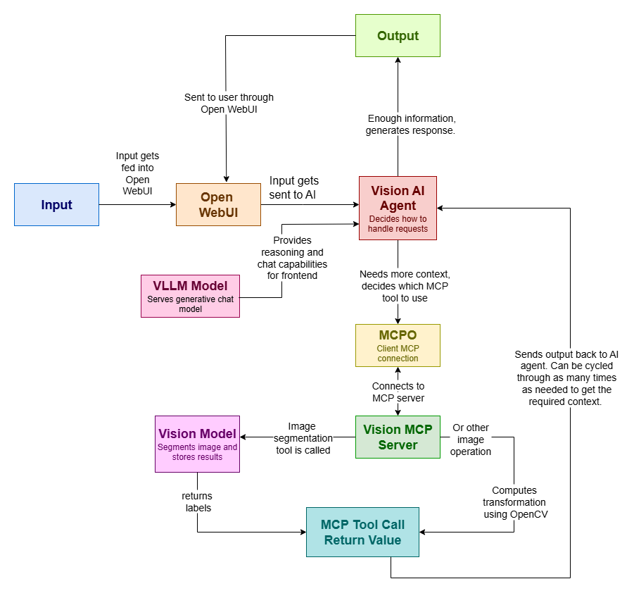
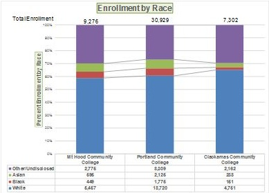
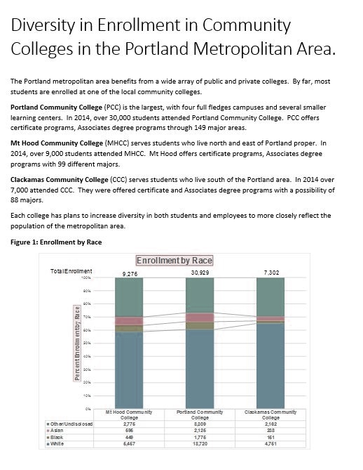

<div align="center">

<h1> ⭐  AMD AI Vision Agent ⭐ </h1>
meow
<div align="left">

<!-- TABLE OF CONTENTS -->

<details>
  <summary>✨ Table of Contents ✨ </summary>
  <ol>
    <li>
      <a href="#star2-about-the-project-star2">About The Project</a>
      <ul>
        <li><a href="#sparkles-how-it-works-sparkles">How it Works</a></li>
      </ul>
    </li>
    <li>
      <a href="#star2-getting-started-star2">Getting Started</a>
      <ul>
        <li><a href="#sparkles-prerequisites-sparkles">Prerequisites</a></li>
        <li><a href="#sparkles-installation-sparkles">Installation</a></li>
      </ul>
    </li>
    <li><a href="#star2-usage-star2">Usage</a>
      <ul>
        <li><a href="#sparkles-examples-sparkles">Examples</a></li>
      </ul></li>
    <li><a href="#star2-troubleshooting-star2">Troubleshooting</a></li>
    <li><a href="#star2-frequently-asked-questions-star2">Frequently Asked Questions</a></li>
    <li><a href="#star2-contact-star2">Contact</a></li>
    <li><a href="#star2-license-star2">License</a></li>
    <li><a href="#star2-acknowledgments-star2">Acknowledgments</a></li>
  </ol>
</details>

<!-- ABOUT THE PROJECT -->

## :star2: About The Project :star2:

Model Context Protocols (MCPs) have brought a new perspective on AI and Large Language Models (LLMs), emerging as a powerful tool able to connect multiple models and APIs to remote machines. The  open-source framework works similar to REST API and provides an interface that allows models to interact with data and context, universalizing the way that AI agents integrate into systems. This project demonstrates the capabilities of MCPs and how they can be used with AMD ROCm machines. The repository contains a Docker Compose file that uses vLLM to build an AI vision agent that has function calling capabilities. It contains tools and functionalities to segment images of documents as well as add color filters. 

This AI Vision Agent will allow users to quickly and easily be able to process images with an MCP server that provides segmentation tools, color filters for accessibility, and basic image functions such as crop and resize. 

### :sparkles: How it Works :sparkles:

* 

The AI agent uses Open WebUI for its user interface. For the OpenAI model connecton, it uses the rocm instance of vllm to serve the a vllm model (default Microsoft Phi Multimodal). Open WebUI uses MCPO for its MCP client connection, which hosts the MCP as a tool server; however, this limits the MCP to just its tool capabilities.

MCPO exposes the tools on the MCP server to the AI agent on Open WebUI allowing the agent to choose whichever tools it may need for a request. The Vision MCP server provides several tools to segment and modify images. For segmentation, the MCP server uses a [RT-DETRv2](https://github.com/lyuwenyu/RT-DETR/tree/main/rtdetrv2_pytorch) architecture to run a [document layout model](https://huggingface.co/ds4sd/docling-layout-heron) that uses an object detection and classification to draw bounding boxes on document objects. The classes that it provides are:

*    Caption
*    Footnote
*    Formula
*    List-item
*    Page-footer
*    Page-header
*    Picture
*    Section-header
*    Table
*    Text
*    Title
*    Document Index
*    Code
*    Checkbox-Selected
*    Checkbox-Unselected
*    Form
*    Key-Value Region

Segmentation results return labels, scores, and bounding box coordinates. Other tools use PIL and cv2 to visualize the results and conduct basic image operations and filtering.

The response from each tool that the AI agent calls is then fed back into the agent where it decides if the information that it has is enough to answer the user input. If it is not, it cycles through the tool calling cycle until it decides that the information is enough. Once the AI Agent reaches that point, it builds a response using the information that it retrieved from the tool calls and returns that back out to the user.

* 

<!-- GETTING STARTED -->

## :star2: Getting Started :star2:

### :sparkles: Prerequisites :sparkles:

* **Linux**: see the [supported Linux distributions](https://rocm.docs.amd.com/projects/install-on-linux/en/latest/reference/system-requirements.html#supported-operating-systems).
* **ROCm**: see the [installation instructions](https://rocm.docs.amd.com/projects/ install-on-linux/en/latest/tutorial/quick-start.html).
* **GPU**: AMD Instinct™ MI300X accelerator or [other ROCm-supported GPUs](https://rocm.docs.amd.com/projects/install-on-linux/en/latest/reference/system-requirements.html).
* **Docker**: with Docker Compose - [install](https://docs.docker.com/engine/install/).

### :sparkles: Installation :sparkles:

1. Clone the repo
   
   ```sh
   git clone https://github.com/github_username/repo_name.git
   ```
2. Change git remote url to avoid accidental pushes to base project
   
   ```sh
   git remote set-url origin github_username/repo_name
   git remote -v # confirm the changes
   ```

3. Create a new folder to store image files `images` and a new folder to store open-webui files
  ```sh
  mkdir images open-webui
  mkdir open-webui/images
  mkdir mcp/images
  ```

3. Run the docker compose file to build and start up the containers
   
   ```sh
   docker compose up -d
   ```

* The current docker compose file is set up with the model Llama-xLAM-2-70b-fc-r, which is optimized for function calling capabilities. To change the model, replace the command parameter of the vllm service with:
  
  ```yaml
  command: ["/bin/sh", 
            "-c", 
            "vllm serve <model_name> 
            --port 8001 --enforce-eager 
            --gpu-memory-utilization 0.95 --tensor-parallel-size 2"]
  ```
* Make sure to set up the vllm container to direct to your local models folder. You can do this by modifying the volumes parameter
  
  ```yaml
  volumes:
    - </path/to/your/models>:/hf_home
  ```
* Ensure that the OpenWebUI container is redirected to the proper local path
  
  ```yaml
  open-webui:
    ...
    - volumes:
      - </path/to/your/repository>/open-webui:/app/backend/data
      - </path/to/your/repository>/images:/app/backend/data/images
  ```

* Ensure that the MCP container is redirected to the proper local path
  
  ```yaml
  mcp:
    ...
    - volumes:
      - </path/to/your/repository>/images:/mcp/images
  ```

* Ensure that the Images container is redirected to the proper local path so that image urls can be generated properly
  
  ```yaml
  images:
    ...
    - volumes:
      - </path/to/your/repository>/images:/usr/local/apache2/htdocs/
  ```

* The AI agent should automatically connect to the OpenWebUI image. If it does not, simply go to the `admin panel`, and in `settings` under `connections` add a new connection with the url `http://vllm:8000/v1` and verify the connection.

4. To stop the Ai Agent, simply do
   
   ```sh
   docker compose down
   ```

## :star2: Usage :star2:

✨ **If you are using the Vision MCP Server**
The Vision mcp server code is set up in the [/mcp](/mcp) directory which contains the scripts to run the MCP server as well as a separate README for the server contianing information about the recommended setup for Open WebUI.

If you would like to use a different vision model, the segmentation implementation is located in [tools.py](mcp/tools.py) in the function `segment()`

The Vision MCP Server currently provides these functions:

* `**segment**(*file*)`: Segments the image into layout categories.
  * Inputs:
    *  `file` (string): the image to be segmented
  * returns the labels of the segments found 

* `**visualize_segmentation**(*file*)`: Visualizes a segmented image by drawing colored bounding boxes onto the image
  * Inputs:
    * `file` (string): the image that has been segmented. If not provided, this should be the last inputted image in the conversation history. 
  * returns an image with the boxes drawn designating segments 

* `**get_specific_segment**(*file*, *label*, *idx* = 0)`: Retrieves a segment of the image and saves it as a file. 
  * Inputs:
    * `file` (string): the image that has been segmented. Must have first called  `segment`. Can be retrieved through conversation history
    * `label` (string): the label of the segment to retrieve
    * `idx`: (optional default = 0) if there are multiple segments with the same label, the index of the specific segment to retrieve
  * returns the image cropped to the region of the segment

* `**correct**(*file*, *dp* = 1, *pp* = 1)`: Applies a color-correcting filter onto a given image for colorblind vision
  * Input:
    * `file` (string): the inputted image
    * `dp` (int): (default 1) the degree of protanopia colorblindness
    * `dd` (int): (default 1) the degree of deuteranopia colorblindness
  * Returns:
    * the color-corrected image in markdown format

* `**simulate**(*file*, *color*, *degree* = 1)`: Simulates an image in colorblind vision by converting to LMS colorspace and applying a transformation matrix. 
  * Inputs:
    * `file` (string): the inputted imgae
    * `color` (string) : the type of colorblindness
    * `degree` (string) : the degree of colorblindness
  * Returns:
    * The markdown image simulated in colorblind vision

* `**crop**(*file*, *top*, *bottom*, *left*, *right*)`: Crops an image. 
  * Inputs: 
    * `file` (string): the inputted image file
    * `top` (int): the number of pixels from the top of the upper bound of the region being cropped (y0) (default 0)
    * `bottom` (int): the number of pixels from the top to the lower bound of the region being cropped (y1) (default 0)
    * `left` (int): the number of pixels from the left to the left bound of the region being cropped  (x0) (default 0)
    * `right` (int): the number of pixels from the left to the right bound of the region being cropped (x1) (default 0)
  * Returns:
    * string: The image link formatted in markdown containing the image stored in `file` cropped to the region of interest designated by the crop box: (top:bottom, left:right)
  
* `**resize**(*file*, *size*, *scale_x*, *scale_y*):` Resizes an image. 
  Inputs: 
    * `file` (string): the inputted image file
    * `size` (tuple): the size (x, y) to resize the image to. If size is (0, 0), then scale factors will be used instead.
    * `scale_x` (int): the scale to horizontally resize the image by. (default 1)
    * `scale_y` (int): the scale to vertically resize the image by. To keep the aspect ratio, this input should be equal to scale_x (default 1)
  * Returns:
    * string: The image link formatted in markdown containing the resized image using bilinear interpolation

To parse Open WebUI's image inputs, add the provided [filter function](/filter.py) to Open WebUi's functions in the Admin Panel. Ensure that the function is fully enabled in the model that you are using. Open WebUi reads images as base64 urls, so this function catches all image inputs, parses the base64 image, and stores the string in a text file, replacing the file upload with a text message containing the image file name. This is so that the AI Agent does not need to support multimodal inputs in order to function. 

If set up correctly, Open WebUI saves these images in a folder in its container labled `images`, which is volume mapped to an images folder in the repository. The MCP has a similar mapping which it uses to read and store images. These volume mappings make it possible for Open WebUI and MCP to send and recieve images. You can also directly upload images through the repository. 

Additionally, in order to view images in Open WebUI, they must be formatted in markdown with an image url. Since base64 urls are long and may get obscured by the AI model, this application uses httpd to serve a http server on the images folder in the repository, allowing images to be viewed with urls: `http://localhost:8004/<image_name>.jpg`. All images are saved as jpg files. 

### :sparkles: Examples :sparkles:

This is a segmented image with visualized bounding boxes: 
* 

This is the image cropped to the chart region of interest:
* 

This is the image color corrected using dp and pp of 1: 
* 

## :star2: Troubleshooting :star2:

* To view logs:
  Run:
  ```sh
  docker compose logs -f <container-name>
  ```
  
* If Open WebUI does not load (if the webpage isn't connecting or if the page is stuck on the Open WebUI loading screen):
  * Ensure that you are forwarding the Open WebUI port (default 3000). In VSCode, this can be done by switching to the `ports` tab in the lower window and adding the port to the forwarded ports. 
  * You may need to update Open WebUI to the latest version. Stop and remove all containers and run
    ```sh
    docker pull ghcr.io/open-webui/open-webui:main
    ```
    to pull the latest docker image
  * If this does not work, try clearing browser history or connecting to the page through incognito/privacy mode.
  * Try stopping the contianer and rebooting the local computer and check your local internal connection.
  * Open WebUI may be stuck attempting to connect to something else. Check all of your docker containers to make sure they are functioning properly. Open WebUI can also be run in dev mode to view its Swagger API

* If the VLLM server is not connecting to Open WebUI
  * Check the connection by pinging the VLLM 
    ```sh
    curl http://localhost:8000/v1/models
    ```
  * Check the vllm's Swagger API at [http://localhost:8000/docs](http://localhost:8000/docs)
  * Ensure the VLLM url in Open WebUI is [http://vllm:8000/docs](http://vllm:8000/docs)
  * Check port forwarding and local connections
  * Make sure that you do not have any other instances of Open WebUI running on either the local or remote machine with the same port.
    
* If the VLLM server is not connecting to the Poetry MCP Server
  * Check the steps above
  * Try interchanging http://localhost:8000/v1 and http://vllm:8000/v1 for the OpenAI url
    
* If the MCP server is not connecting to the Open WebUI
  * Check all of the steps above
  * Check the Swagger API for the MCP server
  * Open the Open WebUI server in incognito/privacy mode

* If the application stops working in the middle of a conversation
  * The conversation context may be too long. Try opening a new conversation.

<!-- FAQ -->
## :star2: Frequently Asked Questions :star2:
> Why MCP?
  * Gen AI is powerful, but its knowledge base is shallow and only contians the information that it has been trained on or the information that the user provides it. This can cause the model to hallucinate, pulling from a variety of potentially misleading information sources and generating an answer that is either wildly inaccurate or gibberish, such as with the example of rhymes. The AI model does not know that it is wrong, because it does not have the information to tell it that it is wrong. MCP connects AI models to such an information source, giving it the *context* that it needs to provide accurate, helpful answers for specific and complex applications. These information sources can be databases or APIs. An AI agent can uses this context to conduct context specific tasks such as generating poetry feedback by referencing information about rhyme and meter and works by published poets to provide the most accurate, informated response. MCP also allows for the AI Model to connect to multiple information sources and tools, providing the information that allows the AI agent to choose which to use in a given situation.
  
> What are the applications of this project?
  * This server can be used for downstream image classification for document images (charts -> flowcharts/linegraph/...), text recognition, or any other functionalities. The base functionalities provide many applications for document and image analysis and with MCP, this can allow for a powerful AI Vision agent. This project provides a framework that uses MCP and AMD ROCm GPUs to build an agentic vision-based application and can be modified to fit many other applications. 

> Can this application be run locally? What if I have super cool gpus?
  * Short answer, no. This application wasn't meant to run on a local computer, since it needs a large model context length. It would be both easier and better to have one instance of the application running with a large 70B model with multiple remote connections. The MCP sever also is able to handle concurrent requests for this application. However, this model can be run a smaller 1B model for testing and experimentation

> How can I use a different MCP server?
  * Replace the MCP service in the Docker Container with the necessary parameters for the MCP server. If you are hosting your own server, make sure to change the Dockerfile to copy your server files to the container files by using `COPY <filename>` and ensure that all dependencies are listed in the `requirements.txt` file. In the Docker Compose, change the command parameter to be
    ```yaml
     command: ["mcpo", "--port", "8002", "--", "<cmd>", "<for your server>"]
    ```
    such as:
    ```yaml
     command: ["mcpo", "--port", "8002", "--", "python", "server-name.py"]
    ```
<!-- CONTACT -->

## :star2: Contact :star2:

Amy Suo - amysuwoah@gmail.com / amy.suo@amd.com / as331@rice.edu

Project Link: [https://github.com/luminarchy/AMD2025VisionAgent](https://github.com/luminarchy/AMD2025VisionAgent)

<!-- License -->
## :star2: License :star2:

The [Microsoft Phi Multimodal Model](https://huggingface.co/microsoft/Phi-4-multimodal-instruct) used in this project is created by Microsoft and is published under the MIT license. 

The [vision model](https://huggingface.co/ds4sd/docling-layout-heron) used in this project is a part of the [Docling](https://github.com/docling-project/docling) project

<!-- ACKNOWLEDGMENTS -->

## :star2: Acknowledgments :star2:

* [AMD ROCm Blogs](https://rocm.blogs.amd.com/)
* [VLLM](https://docs.vllm.ai/en/v0.6.5/index.html)
* [FastMCP](https://gofastmcp.com/getting-started/welcome)
* [MCPO](https://github.com/open-webui/mcpo)
* [Microsoft Phi Multimodal Model](https://huggingface.co/microsoft/Phi-4-multimodal-instruct)
* [Layout Model](https://huggingface.co/ds4sd/docling-layout-heron)
* See also: [Database AI Agent](https://github.com/luminarchy/AMD-2025-AI-Agent-Demo)


